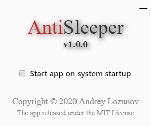

# AntiSleeper
The app prevent your PC from auto sleeping.

# Supported OS
- Microsoft Windows
- MacOS

# How to build app?
Download or clone this project:
```
$ git clone https://github.com/lozunoff/antisleeper
$ cd antisleeper
```
Install all dependencies:
```
$ npm i
```
Package the application for your platform:
```
$ npm run package
```
Package the application for another platform:
```
$ npx electron-forge package --arch=<architecture> --platform=<platform>
```
The application is ready to use. Run it from the folder "out/antisleeper-\<platform\>-\<arch\>/".

# Example


# License
The app released under the [MIT License](https://github.com/lozunoff/antisleeper/blob/master/LICENSE).
